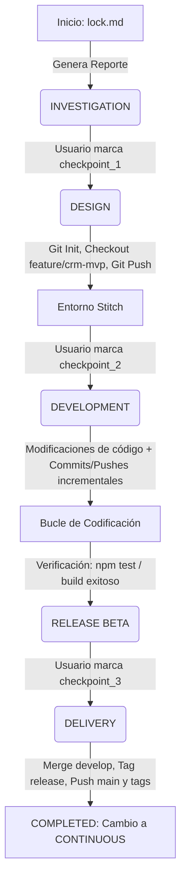

# Arquitectura del Workflow Agéntico - Antigravity Core

> Arquitectura de IA Bifásica Libre de Código — 2026.6.19

---

## 📋 Resumen

Este repositorio es una **Plantilla Maestra / Framework Orquestador Agéntico** desacoplado. A diferencia de las soluciones tradicionales basadas en scripts locales, este motor opera de manera **100% agéntica**, lo que significa que la máquina de estados, el watcher de archivos y las transiciones del ciclo de vida son ejecutadas por la propia IA que asiste en el espacio de trabajo.

La arquitectura se divide en dos fases del ciclo de vida del desarrollo:
1. **Fase MVP:** Creación conceptual con NotebookLM, prototipado visual en Google Stitch y desarrollo del MVP con control estricto de Git.
2. **Fase de Desarrollo Continuo (Mantenimiento):** Flujo ágil enfocado en features, mejoras y bugs convencionales.

---

## 🏗️ Estructura del Directorio de Reglas

```plaintext
.agents/
├── ARCHITECTURE.md          # Este archivo de arquitectura
├── agent/                   # 4 Agentes Especialistas (definiciones en markdown)
│   ├── orchestrator.md      # Orquestador del estado y GitFlow
│   ├── conception-agent.md  # Generación de reportes y especificaciones técnicas
│   ├── stitch-designer.md   # Diseño visual y extracción en Stitch
│   └── mvp-builder.md       # Codificación, compilación y verificación
├── skills/                  # Instrucciones para la ejecución de herramientas MCP y CLI
│   ├── notebooklm/          # Skill de NotebookLM
│   ├── stitch-loop/         # Skill de Stitch
│   ├── clean-code/          # Estándares de desarrollo limpio
│   ├── terminal-ops/        # Ejecución y pruebas locales
│   └── git-workflow/        # Flujos profesionales de Git
└── rules/                   # Reglas globales (GEMINI.md)
```

---

## 🤖 Roles y Responsabilidades de los Agentes

| Agente | Fases Activas | Foco Principal | Habilidades Principales |
| :--- | :--- | :--- | :--- |
| `orchestrator` | Todas | Supervisor del estado reactivo, transiciones HITL y GitFlow. | `git-workflow`, `deep-agents-memory` |
| `conception-agent` | MVP & Continuo | Redacción de informes de arquitectura y análisis técnico de requerimientos. | `notebooklm`, `business-model` |
| `stitch-designer` | MVP | Maquetación visual e interactiva en Stitch y compilación de especificaciones de diseño. | `stitch-loop`, `ui-designer`, `design-md` |
| `mvp-builder` | MVP & Continuo | Escritura de código limpio, pruebas locales, depuración y verificación en terminal. | `clean-code`, `terminal-ops` |

---

## 🔄 Flujo de Control por Archivo y Aprobaciones (HITL)

El ciclo de vida se gestiona de manera declarativa usando dos archivos en el proyecto cliente:
1. **`.antigravity/state.json`:** Mantiene el estado interno de la máquina de estados y metadatos extraídos de `lock.md`/`feature.md`.
2. **`.antigravity/approvals.md`:** Checkbox interactivo en formato markdown. El desarrollador aprueba un checkpoint editando el archivo (cambiando `[ ]` por `[x]`).

### Mapeo de Transiciones Git y Checkpoints:



---

## 🚦 Flujo Git en Desarrollo Continuo (Fase B)

Una vez en mantenimiento (`CONTINUOUS`):
1. **Detección:** El desarrollador crea `feature.md`. El orquestador extrae el alcance y crea `.antigravity/temp_spec.md`.
2. **Checkout de Rama:** Al aprobarse la spec (`approve_spec`), el agente crea la rama `feature/nombre-feature` desde `develop` y hace push a origen.
3. **Desarrollo:** El desarrollador y el agente programador trabajan sobre esta rama con commits y pushes continuos.
4. **Fusión:** Tras el build exitoso y aprobación final (`approve_code`), se realiza merge local a `develop`, push a origen de la rama `develop`, y se deja lista en GitHub para Pull Request.
